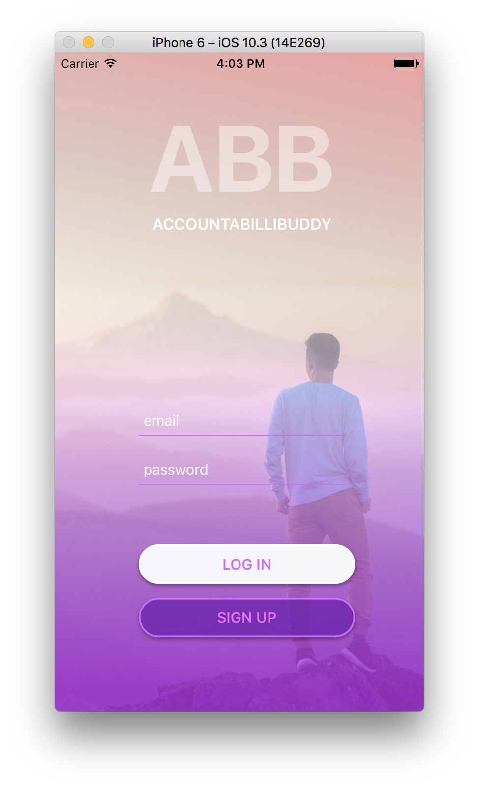
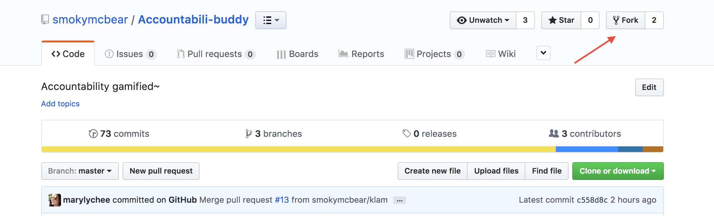
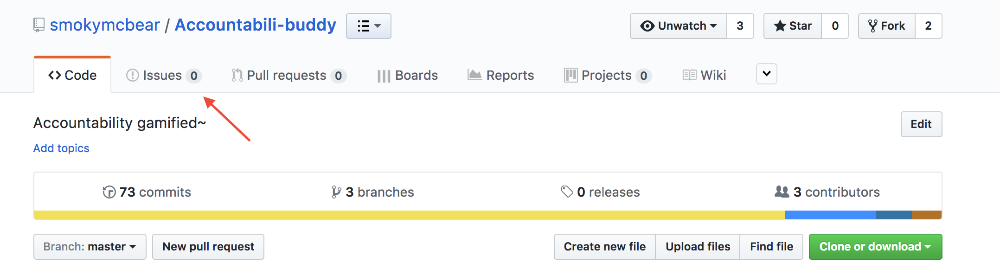
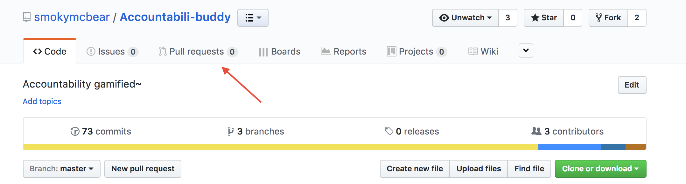

# Accountabili-Buddy

Our team built AccountabiliBuddy - an accountability game to do pushups with coworkers and friends once a day. The idea came from something fun we did as a group consistently as students in the Web Development Immersive program at Galvanize. Every 3:30pm we would all go up on the roof and do 3mins of pushups. It was a fun way to get fresh air and move around, which is important when you have a room of developers who tend to sit for 5-6 hours straight. What was interesting to us was that people were willing to stick to this behaviour and log their results on an excel and compare and track their individual growth as well to ‘race’ each other. This idea of gamification led us to develop a mobile app version of PushUpHr.
We used React Native, Redux, with Node.js and Express, and Bookshelf in the Back End.

### Get Started

##### iOS

Download & install [Xcode](https://itunes.apple.com/us/app/xcode/id497799835?mt=12) from the App Store.

We are using [React-Native](https://facebook.github.io/react-native/) in this project so run these commands if you do not have React-Native already:
  - `brew install node` to install node
  - `brew install watchman` to install watchman
  - `npm install -g react-native-cli` to install React-Native's command line interface

Now that we have React-Native on our system, let's git clone or fork and install all our dependencies!

If you aren't familiar with git, we can clone for now. However, if you want to make future changes and track your changes over time, be sure to make a fork.

- `cd PROJECT_DIRECTORY` (be sure that your current working directory is `Accountabili-buddy`)
- `npm install` to install all our dependencies into the `node_modules` folder.
- `react-native run-ios` to run the project

Happy Coding! 💻

##### Android

For Android testing, follow the steps on [React Native Getting Started](https://facebook.github.io/react-native/docs/getting-started.html) and select Mobile OS: Android and Development depending on your machine.

Clone or fork and install all our dependencies.

When you're done with the preview step, like in IOS run these commands:
- `cd PROJECT_DIRECTORY` (be sure that your current working directory is `Accountabili-buddy`)
- `npm install` to install all our dependencies into the `node_modules` folder.
- `react-native run-android` to run the project.

NOTE: in order to see the emulator with Android Studio you first need to open it, run the app, and then run the command `react-native run-android`.

### Web version

[Accountabili-buddy-web](https://github.com/smokymcbear/accountabili-buddy-web)

### API

[Accountabili-buddy-API](https://github.com/smokymcbear/accountabili-buddy-api)

### Found a bug?

Feel free to post a Github issue and we'll get started on resolving that nasty bug 🐛

### How can I contribute?

If you __are__ familiar with Git, feel free to make a PR and we'll have our team review your contribution before merging.

---

If you are __not__ familiar with Git, make a fork of this repository and create a remote pointing to this repository.

`git remote add upstream https://github.com/smokymcbear/Accountabili-buddy.git`

Once you've made some changes and you're ready to merge with our code, create a pull request here:

Select the branch that you've made your changes on and create the pull request.

Thank you for your contributions! Woot! 🎉

#### Contributors:

- Kevin Lam [@smokymcbear](https://github.com/smokymcbear)
- Paola Claros [@paolitaclo](https://github.com/paolitaclo)
- Mary Lai [@marylychee](https://github.com/marylychee)
